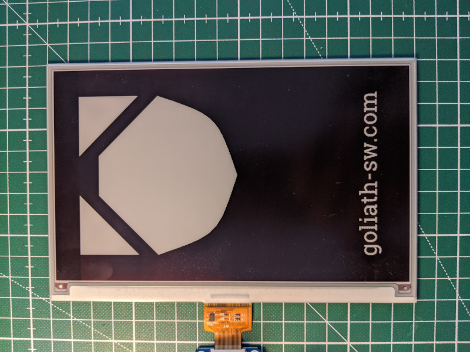

**Disclaimer:** The code is roughly based on the original code by [:link:waveshare](https://github.com/waveshare/e-Paper).

waveshare_pyepd
====

A cleaned up driver for the waveshare epd7in5 in black/white and black/white/color.

# Overview



If the connector points towards you then the first pixel is in the upper left corner.

# Install

```sh
sudo apt install libatlas3-base # to get correct numpy version via PIP
#sudo apt-get install python3-numpy
pip install git+https://github.com/dkudlek/waveshare_pyepd
```
